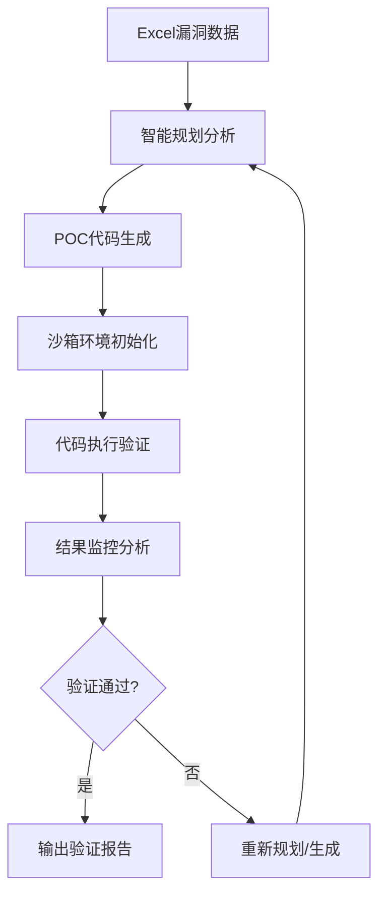

# 沙箱Agent (Sandbox Agent)

基于LangChain和LangGraph的智能漏洞验证PoC生成系统，支持从Excel文件批量读取漏洞数据，自动化生成、执行和验证PoC代码。

## 🎯 项目概述

沙箱Agent是一个专业的安全漏洞验证工具，能够：
- 📖 从Excel文件批量读取漏洞数据
- 🧠 智能分析漏洞并生成执行计划
- 💻 自动生成PoC验证代码
- 🛡️ 在沙箱环境中安全执行验证
- 📊 评估结果并自动重试优化
- 📋 生成详细的执行报告

## 🔄 Evaluator-Optimizer 工作流架构

基于LangChain官方模式实现的评估器-优化器工作流，完全遵循官方模式：



### 核心工作流程

```
START
  │
  ▼
┌─────────────────┐
│   Planning      │
│                 │
│  • 分析漏洞     │
│  • 制定计划     │
└─────────────────┘
  │
  ▼
┌─────────────────┐
│ PoC Generation  │
│                 │
│  • 生成PoC代码  │
│  • 编写测试     │
└─────────────────┘
  │
  ▼
┌─────────────────┐
│ Sandbox Execute │
│                 │
│  • 执行验证     │
│  • 分析结果     │
└─────────────────┘
  │
  ▼
┌─────────────────┐
│ Evaluate &      │◄─── 条件边决策
│    Decide       │
│                 │
│  • 评估结果质量  │
│  • 决定下一步   │
└─────────────────┘
  │
  └─────────────────┬─────────────────┐
                    │                 │
              ┌─────▼─────┐     ┌─────▼─────┐
              │   成功   │     │   重试    │
              │  (END)   │     │  (回到)   │
              └─────────┘     │  Planning  │
                              └───────────┘
```

## ✨ 核心特性

### 🚀 工作流自动化
- **智能规划**: 基于漏洞信息自动生成验证策略
- **代码生成**: 根据计划生成高质量的PoC代码
- **安全执行**: 在隔离环境中运行PoC验证
- **结果评估**: 自动评估验证效果并决定是否重试

### 📊 批量处理能力
- **Excel集成**: 支持从Excel文件批量导入漏洞数据
- **并发处理**: 高效处理大量漏洞验证任务
- **进度跟踪**: 实时显示处理进度和统计信息

### 🔧 灵活配置
- **命令行参数**: 支持运行时自定义配置
- **可扩展性**: 模块化设计，易于扩展和定制
- **错误处理**: 完善的错误处理和重试机制

## 🏗️ 系统架构

### 核心组件

1. **Planning Agent**: 分析漏洞信息，生成执行计划
2. **PoC Generation Agent**: 根据计划生成验证代码
3. **Sandbox Agent**: 在安全环境中执行PoC代码
4. **Workflow Engine**: 基于LangGraph的工作流引擎
5. **Data Processor**: Excel数据读取和处理模块

### 工作流阶段详解

#### 1. 规划阶段 (Planning)
- **功能**: 分析漏洞信息，生成执行计划
- **输入**: `VulnResult`
- **输出**: `PlanningResult`

#### 2. PoC生成阶段 (PoC Generation)
- **功能**: 根据计划生成验证代码
- **输入**: `PlanningResult`
- **输出**: `PocResult`

#### 3. 沙箱执行阶段 (Sandbox Execution)
- **功能**: 在安全环境中执行PoC
- **输入**: `PocCode`
- **输出**: `SandboxResult`

#### 4. 评估与决策 (Evaluate & Decide) ⭐
- **功能**: 评估执行结果并决定下一步
- **逻辑**:
  - 成功指标检测 → END
  - 失败检测 → 增加重试次数
  - 达到最大重试 → END
  - 否则 → 回到Planning或PoC Generation

## 🚀 快速开始

### 环境要求

- Python 3.8+
- OpenAI API Key
- 足够的计算资源用于AI模型调用

### 安装依赖

```bash
git clone <repository-url>
cd sandbox-agent
pip install -r requirements.txt
```

### 配置环境变量

创建 `.env` 文件：
```env
OPENAI_API_KEY=your_openai_api_key_here
OPENAI_BASE_URL=https://api.openai.com/v1  # 可选：自定义API端点
```

### 准备数据文件

创建包含漏洞数据的Excel文件，需包含以下列：

| 列名 | 类型 | 说明 | 必需 |
|------|------|------|------|
| `type` | 文本 | 漏洞类型 | ✅ |
| `description` | 文本 | 漏洞描述 | ✅ |
| `filename` | 文本 | 漏洞触发点路径 | ✅ |
| `code` | 文本 | 漏洞触发点代码 | ✅ |
| `impact` | 文本 | 漏洞影响 | ✅ |
| `result` | 文本 | 漏洞报告/分析结果 | ✅ |

**注意**：
- `result` 字段会映射到工作流中的 `initial_analysis` 参数
- 每行数据会被自动分配唯一的漏洞ID

## 📋 使用方法

### 基本用法（使用默认参数）
```bash
python main.py
```

### 自定义参数

#### 指定Excel文件
```bash
python main.py -e /path/to/your/data.xlsx
python main.py --excel vulnerabilities.xlsx
```

#### 指定代码仓库
```bash
python main.py -c /path/to/your/repo
python main.py --code-repo /codesec/PROJECT/v1.0
```

#### 指定最大迭代次数
```bash
python main.py -i 5
python main.py --iterations 10
```

#### 指定输出目录
```bash
python main.py -o /path/to/output
python main.py --output ./my_results
```

#### 组合使用多个参数
```bash
python main.py -e data.xlsx -c /custom/repo -i 5 -o ./custom_results
```

## 📊 命令行参数

| 参数 | 短参数 | 长参数 | 默认值 | 说明 |
|------|--------|--------|--------|------|
| Excel文件路径 | `-e` | `--excel` | `./format-af-result.xlsx` | 指定包含漏洞数据的Excel文件路径 |
| 代码仓库路径 | `-c` | `--code-repo` | `/codesec/AF8048/AF8.0.48` | 指定代码仓库路径 |
| 最大迭代次数 | `-i` | `--iterations` | `3` | 指定工作流最大迭代次数 |
| 输出目录 | `-o` | `--output` | `./results` | 指定结果输出目录 |

获取帮助：
```bash
python main.py --help
```

## 📊 输出结果

程序执行完成后，会在指定的输出目录下生成：

### 1. 详细结果文件
- **文件名**: `poc_workflow_results_TIMESTAMP.xlsx`
- **内容**: 包含每个漏洞的详细执行结果
- **字段**: 成功状态、迭代次数、PoC路径、错误信息等

### 2. 摘要报告文件
- **文件名**: `poc_workflow_summary_TIMESTAMP.txt`
- **内容**:
  - 执行统计信息（总数量、成功率等）
  - 每个漏洞的简要处理结果
  - 错误汇总和分析

### 示例输出

```
🚀 启动沙箱Agent主程序
📁 Excel文件: ./format-af-result.xlsx
📂 代码仓库: /codesec/AF8048/AF8.0.48
🔄 最大迭代次数: 3
💾 输出目录: ./results

📖 第一步：读取漏洞数据
正在读取Excel文件: ./format-af-result.xlsx
成功读取Excel文件，共 5 行数据
Excel文件列名: ['type', 'description', 'filename', 'code', 'impact', 'result']

🔧 第二步：执行PoC生成工作流
================================================================================
开始处理漏洞: vuln_001_20241126_143025
类型: FORMAT_STRING_VULNERABILITY
文件: tamperAdminView.cpp
================================================================================

📊 第三步：导出执行结果
结果已导出到: ./results/poc_workflow_results_20241126_143025.xlsx
摘要报告已导出到: ./results/poc_workflow_summary_20241126_143025.txt

📈 执行完成统计:
  总处理数量: 5
  成功数量: 4
  失败数量: 1
  成功率: 80.0%
✅ 程序执行完成
```

## 📁 项目结构

```
sandbox-agent/
├── main.py                              # 主入口程序
├── requirements.txt                     # 依赖包列表
├── .env.example                         # 环境变量示例
├── README.md                           # 项目说明文档
├── format-af-result.xlsx               # 示例数据文件
├── src/
│   ├── core/
│   │   ├── workflow.py                 # 主要工作流实现
│   │   ├── evaluator_optimizer_workflow.py  # 复杂工作流实现
│   │   ├── simplified_evaluator_optimizer.py  # 简化工作流实现
│   │   └── evaluator.py                # 评估器模块
│   ├── agents/
│   │   ├── planning_agent.py           # 规划代理
│   │   ├── pocgen_agent.py             # PoC生成代理
│   │   └── sandbox_agent.py            # 沙箱执行代理
│   ├── models/
│   │   ├── workflow_models.py          # 工作流数据模型
│   │   ├── planning_models.py          # 规划数据模型
│   │   ├── poc_models.py               # PoC数据模型
│   │   └── sandbox_models.py           # 沙箱数据模型
│   ├── clients/
│   │   └── openai_client.py            # OpenAI客户端
│   ├── tools/
│   │   ├── README.md                   # 工具集说明文档
│   │   ├── file_system_tools.py       # 文件系统工具
│   │   ├── code_analysis_tools.py     # 代码分析工具
│   │   ├── system_tools.py            # 系统操作工具
│   │   └── file_tools.py              # 文件操作工具
│   └── utils/
│       └── logger.py                   # 日志工具
├── tests/                              # 测试文件
│   └── test_simplified_workflow.py     # 工作流测试
└── results/                            # 输出结果目录
```

## 🔧 开发指南

### 核心模块说明

#### 1. 工作流引擎 (`src/core/`)
- **workflow.py**: 基于LangGraph的工作流实现
- **simplified_evaluator_optimizer.py**: 极简评估器-优化器实现
- **evaluator_optimizer_workflow.py**: 复杂工作流实现
- **evaluator.py**: 评估器模块

#### 2. 智能代理 (`src/agents/`)
- **PlanningAgent**:
  - 分析漏洞信息和代码
  - 制定详细的验证计划
  - 考虑历史执行反馈

- **PocGenAgent**:
  - 根据计划生成PoC代码
  - 确保代码质量和可执行性
  - 添加必要的测试逻辑

- **SandboxAgent**:
  - 在安全环境中编译和执行PoC
  - 监控执行过程和输出
  - 分析执行结果

#### 3. 数据模型 (`src/models/`)
- **VulnResult**: 漏洞基础数据模型
- **WorkflowState**: 工作流状态管理
- **PlanningResult**: 规划结果模型
- **PocResult**: PoC生成结果模型
- **SandboxResult**: 沙箱执行结果模型

### 评估逻辑

#### 成功指标
- "漏洞验证成功", "vulnerability confirmed"
- "内存地址", "0x", "格式化字符串", "leaked"

#### 失败指标
- "编译错误", "compile error", "syntax error"
- "runtime error", "segmentation fault"

#### 重试策略
- **代码问题** (编译/语法错误) → 回到PoC Generation
- **其他问题** → 回到Planning
- **达到最大重试** → 中止

### 扩展开发

#### 添加新的评估逻辑
```python
# 在 src/core/evaluator.py 中扩展评估逻辑
def custom_evaluation_logic(sandbox_result: SandboxResult) -> bool:
    # 自定义成功/失败判断逻辑
    success_indicators = ["漏洞验证成功", "vulnerability confirmed"]
    return any(indicator in sandbox_result.result for indicator in success_indicators)
```

#### 添加新的漏洞类型支持
```python
# 在相应的Agent中添加对新漏洞类型的处理逻辑
def handle_new_vulnerability_type(vuln_info: VulnResult) -> str:
    if vuln_info.type == "NEW_VULNERABILITY_TYPE":
        # 处理新漏洞类型的特殊逻辑
        return generate_specialized_plan(vuln_info)
    return standard_planning_logic(vuln_info)
```

#### 自定义工作流
```python
# 创建自定义工作流
from src.core.workflow import PocWorkflowGraph

class CustomWorkflow(PocWorkflowGraph):
    def _create_workflow(self) -> StateGraph:
        workflow = super()._create_workflow()

        # 添加自定义节点
        workflow.add_node("custom_step", self._custom_node)

        # 添加自定义边
        workflow.add_edge("evaluation", "custom_step")
        workflow.add_edge("custom_step", "decision")

        return workflow

    def _custom_node(self, state: WorkflowState) -> WorkflowState:
        # 自定义节点逻辑
        return state
```

## 🧪 测试

### 运行单元测试
```bash
# 测试工作流导入
python -c "from src.core.workflow import PocWorkflowGraph; print('✅ 工作流导入成功')"

# 测试代理导入
python -c "from src.agents.planning_agent import PlanningAgent; print('✅ 规划代理导入成功')"

# 测试模型导入
python -c "from src.models.sandbox_models import VulnResult; print('✅ 模型导入成功')"
```

### 运行完整测试
```bash
# 运行工作流测试
python test_simplified_workflow.py

# 运行模块测试
python -m pytest tests/ -v
```

## 🔍 故障排除

### 常见问题

#### 1. 依赖安装失败
```bash
# 升级pip
python -m pip install --upgrade pip

# 使用国内镜像源
pip install -r requirements.txt -i https://pypi.tuna.tsinghua.edu.cn/simple/

# 手动安装缺失的包
pip install pandas openpyxl langchain langgraph openai
```

#### 2. Excel文件读取失败
- 确保文件路径正确
- 检查文件是否被其他程序占用
- 验证Excel文件格式是否正确
- 确保包含所有必需的列

#### 3. API调用失败
- 检查OpenAI API Key是否正确设置
- 确认网络连接正常
- 验证API配额是否充足
- 检查API端点配置

#### 4. 沙箱执行失败
- 检查系统权限
- 确保工作目录有写入权限
- 验证编译环境是否正确安装
- 检查代码是否有语法错误

#### 5. 内存不足错误
- 减少并发处理数量
- 增加系统虚拟内存
- 分批处理大量漏洞数据

### 日志分析

程序运行时会输出详细的日志信息：
- 📖 数据读取阶段：Excel文件解析状态
- 🔧 工作流执行阶段：每个漏洞的处理进度
- 📊 结果导出阶段：文件生成和统计信息
- ⚠️ 错误信息：详细的错误堆栈和解决建议

## ⚙️ 配置选项

### 环境变量
```env
# OpenAI配置
OPENAI_API_KEY=your_openai_api_key_here
OPENAI_BASE_URL=https://api.openai.com/v1
OPENAI_MODEL=gpt-4

# 工作流配置
MAX_ITERATIONS=3
DEFAULT_CODE_REPO=/codesec/AF8048/AF8.0.48
OUTPUT_DIR=./results

# 日志配置
LOG_LEVEL=INFO
LOG_FILE=./logs/sandbox_agent.log
```

### 程序配置
程序支持通过以下方式配置：
1. **命令行参数** (推荐) - 运行时指定，详见命令行参数表格
2. **环境变量** - 通过.env文件或系统环境变量设置
3. **修改默认值** - 在 `main.py` 的 `parse_arguments()` 函数中修改默认值

## 🔒 安全保障

- **沙箱隔离**: 所有代码在隔离环境中安全执行
- **访问控制**: 严格的文件系统和网络访问限制
- **实时监控**: 全程监控代码执行过程
- **错误处理**: 完善的异常处理和错误恢复机制

## 🤝 贡献指南

1. Fork 项目
2. 创建特性分支 (`git checkout -b feature/AmazingFeature`)
3. 提交更改 (`git commit -m 'Add some AmazingFeature'`)
4. 推送到分支 (`git push origin feature/AmazingFeature`)
5. 开启 Pull Request

### 开发规范
- 遵循PEP 8代码风格
- 添加适当的类型注解
- 编写单元测试
- 更新相关文档

## 📄 许可证

本项目采用 MIT 许可证 - 查看 [LICENSE](LICENSE) 文件了解详情。

## 📞 联系方式

- 项目主页: [GitHub Repository]
- 问题反馈: [GitHub Issues]
- 文档: [项目Wiki]

## 🙏 致谢

- [LangChain](https://github.com/langchain-ai/langchain) - 强大的LLM应用开发框架
- [LangGraph](https://github.com/langchain-ai/langgraph) - 状态机工作流引擎
- [OpenAI](https://openai.com/) - 强大的语言模型API

## ❓ 常见问题

**Q: 支持哪些漏洞类型？**
A: 支持多种漏洞类型，包括格式化字符串漏洞、缓冲区溢出、输入验证漏洞等。可以通过扩展模型来支持更多类型。

**Q: 沙箱环境是否安全？**
A: 采用完全隔离环境、严格访问控制和实时监控，确保执行安全。

**Q: 验证结果可靠性如何？**
A: 基于实际执行效果进行分析，结合智能评估逻辑，确保验证结果准确可靠。

**Q: 如何提高成功率？**
A: 可以通过增加迭代次数、优化提示词、改进评估逻辑等方式提高成功率。

---

**重要提醒**: 本工具仅用于安全研究和授权的漏洞测试，请勿用于非法用途。使用前请确保获得适当的授权，并严格遵守相关法律法规。